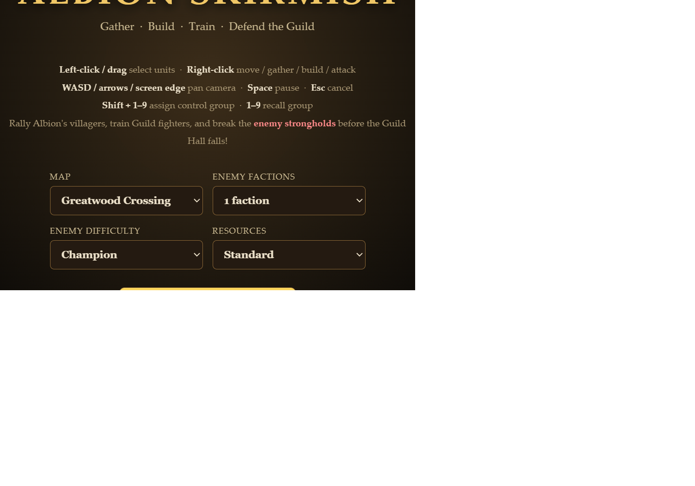
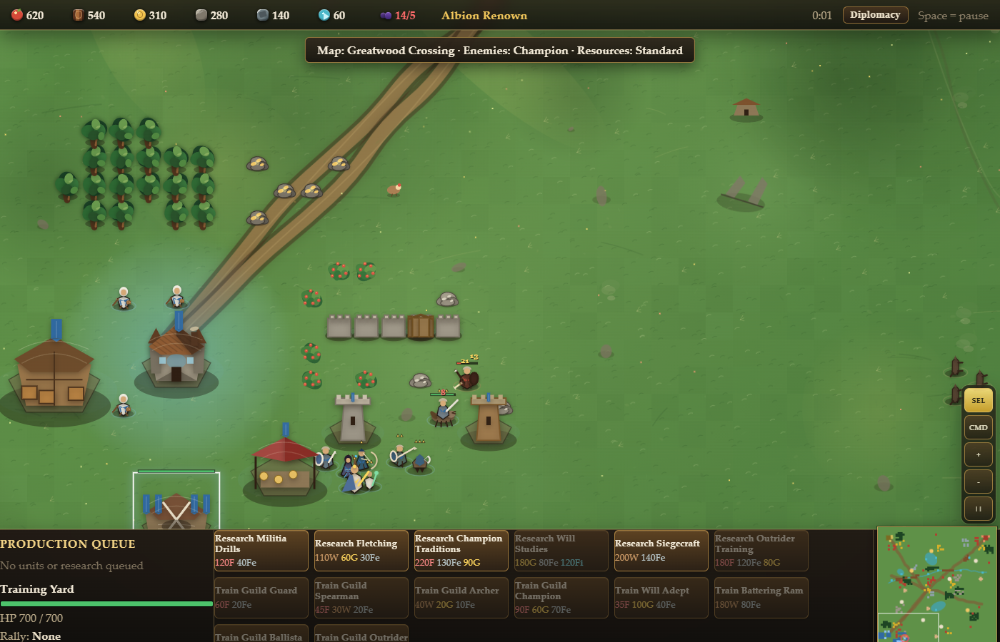
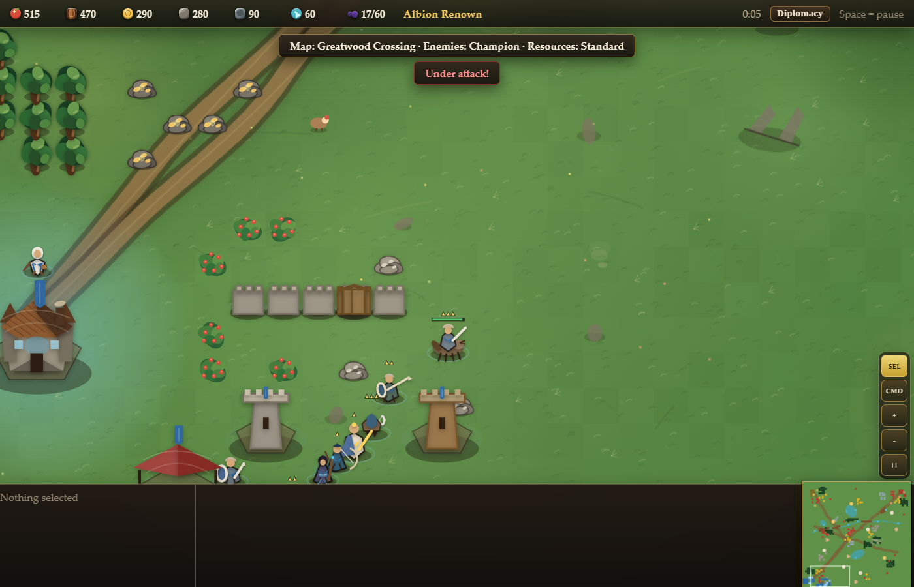
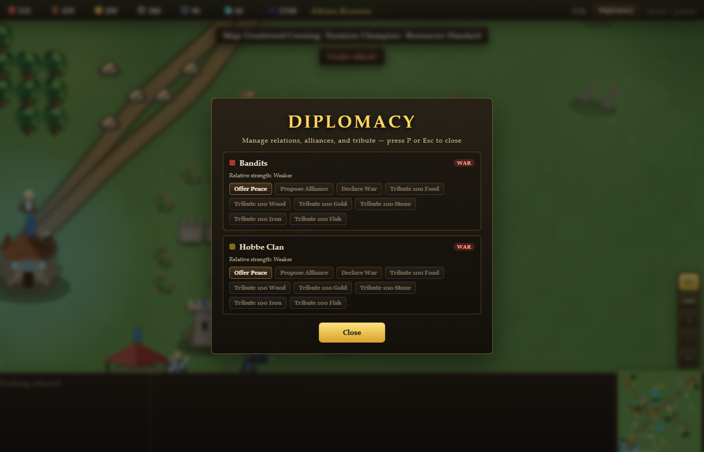
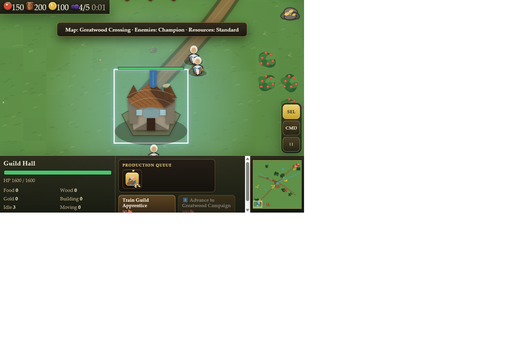
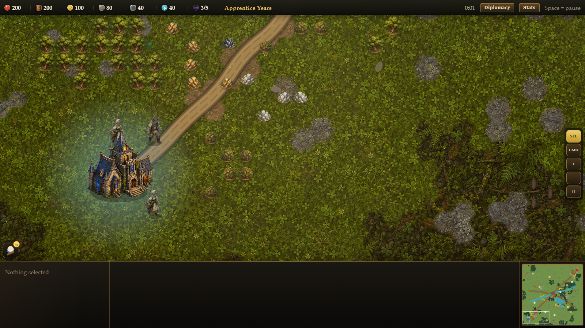

# Albion Skirmish

Albion Skirmish is a browser-playable RTS prototype inspired by Fable: The Lost Chapters flavor and Age of Empires-style controls. Gather resources, build a fortified Guild settlement, research your way through four Ages, train a roster of fighters and a leveling Hero, cast Will magic, manage war/peace/alliance with up to three rival factions, and destroy or outlast every hostile stronghold.

## Running

Open [index.html](index.html) in a modern browser. The game is self-contained and does not require a build step.

## Current Features

### Core
- HTML HUD with resource counters (food/wood/gold/stone/iron/fish), production actions, selection details, minimap, idle-unit badges, and touch controls.
- Expanded pause menu with settings, statistics, diplomacy, and four local save/load slots.
- Canvas-native water and atmosphere effects with no CDN dependency — the game runs entirely offline from a static directory.
- Larger 72 x 72 tile battlefield with generated streams, constrained ponds, span-rendered bridges, fish shoals, and water-aware pathfinding.
- Land units cannot cross deep water except at bridges; larger bodies of water require ferries from an Albion Dock.
- Production buildings show compact square queue tiles with progress and click-to-cancel refunds.
- Touch controls support select-mode marquee, command-mode pan, and two-finger pan/pinch zoom.
- Bleed-safe painted NPC atlases give every gameplay unit real idle, two-phase walk, and action frames; world sites also host animated traders, blacksmiths, and barkeeps.
- Directional mirroring, impact sparks, building dust puffs, ferry wake, cargo pips, and vector fallbacks remain layered around the authored animation frames.

### Fortifications
- Palisade, Stone, and Fortified walls — drag-build a whole line in one click-drag, upgrade a tier in place without losing HP%.
- Buildings can be box-selected, canceled for a full foundation refund, demolished for a partial refund, batch-upgraded, and walls can convert into gates or compact watch towers.
- Guild Gates let friendly units (and allies) pass through while blocking hostiles; lockable, with an animated door swing.
- Watch Towers and Guard Towers fire arrows at hostiles automatically.

### Procedural terrain
- Deterministic elevation, moisture, temperature, slope, biome, variant, and boundary data is generated for every simulation tile from the map seed.
- Eight project-local terrain materials are clipped into a seamless visual hex tessellation, with authored meadow/mud, meadow/rock, and sand/water boundary textures.
- Roads are cheaper to traverse; forest, mud, rock, snow, and sand have distinct movement effort; marsh, shallow water, and cliffs can require traversal equipment.
- Trailcraft Kits unlock wading routes, while Mountaineering Gear unlocks cliff and harsh winter crossings. Weighted A* accounts for the same terrain costs used by movement.
- Advanced launch controls cover landform, biome diversity, forest cover, terrain gates, road density, and start fairness in addition to water and map-size settings.
- Building foundations respect terrain buildability and slope, while resources and completed structures visibly adapt to temperate, evergreen, marsh, dry/coastal, or frozen ground; the minimap and terrain readout expose the same live tile properties.

### Progression
- Units gain XP from kills and level up (Heroes to 8, everyone else to 5), with rank-pip indicators, out-of-combat HP regen, and Temple Acolytes who heal allies even mid-fight.
- A real research tree gates units, forge tiers, and Age advancement — blacksmith forging upgrades weapons/armor with visible equipment overlays.
- Four Ages, from Apprentice Years to Archon's Legacy, each unlocking new units: Battering Rams and Ballistae (bonus damage vs. buildings), Guild Outriders (mounted archers).
- A trainable Guild Hero levels independently, auto-learns Will magic (Fireball, Heal Life, Slow Time) at levels 2/3/5, and revives at the Guild Hall for gold instead of being retrained.
- Villagers can repair damaged buildings, not just construct new ones.

### Diplomacy & economy
- War / peace / alliance relations with every AI faction, managed from a Diplomacy panel (top-bar button or `P`) — offer peace, propose alliance, declare war, or send tribute.
- AI factions can make peace, ally, or betray a peace based on relative strength — and will raid each other, not just the player.
- Victory requires every surviving faction to be allied, not just the player's own survival.
- A Bowerstone Market buys and sells every resource at a fixed spread.
- Albion Farms provide renewable food plots through the normal gather/drop-off pipeline.
- Guild Hall priority presets and per-resource bias chips steer Auto Needs worker assignment.
- Fighter Auto Patrol assigns patrol routes around active apprentice work clusters.
- The start menu supports per-faction difficulty, color, and initial relation setup.

### Magic & threats
- Mages and Heroes cast targeted spells (Fireball AoE, Heal Life, Slow Time) with mana pools and cooldowns, via the same click-to-target flow as building placement.
- A Will Hub lets the player cast global powers (Firestorm, Guild Blessing) anywhere on the map once built, fed by a Will pool.
- Neutral wildlife camps (wolves, wild hobbes, balverines) guard the map and pay a resource bounty when cleared.
- Enemy AI is deliberately less relentless than earlier builds — slower first wave, smaller escalation, and it now needs research to unlock its own units and Ages just like the player.

## Screenshots

Screenshots are generated from the current local build and stored in [docs/screenshots](docs/screenshots):

- [Start menu](docs/screenshots/start-menu.png)
- [In-game view](docs/screenshots/in-game.png)
- [Fortifications: walls, gate, and towers](docs/screenshots/fortifications.png)
- [Diplomacy panel](docs/screenshots/diplomacy.png)
- [Compact production queue](docs/screenshots/production-queue.png)
- [Procedural hex terrain](docs/screenshots/terrain-procedural-preview.png)

## Notes

This is still a single-file prototype. The next sensible step is to split renderer, simulation, UI, and content config into modules before adding heavier art assets or more framework-specific rendering.
